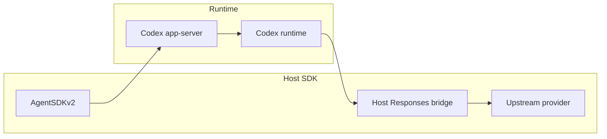
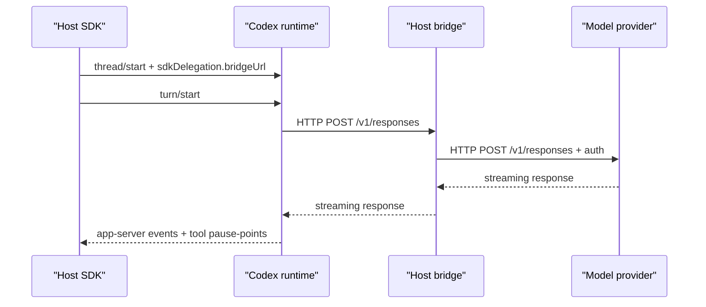
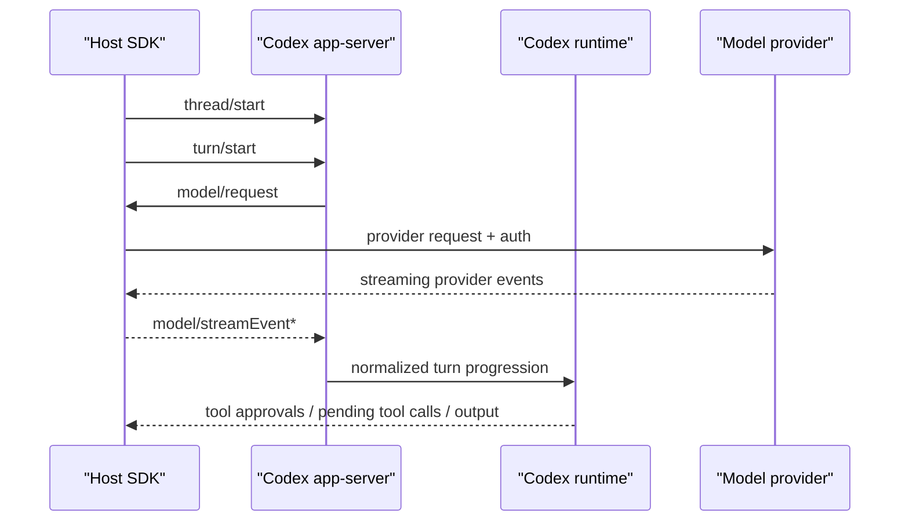
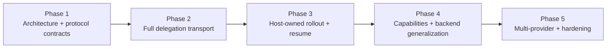

# codex-sdk-v2 Prototype Summary

## 1. Goals of the prototype

This prototype was meant to answer one core question:

Can we reuse Codex as the runtime and tool-execution engine while preserving the Universal Computer model in which the host SDK owns orchestration, configuration, approvals, and provider access?

More concretely, the prototype set out to prove that we can:

- run Codex through app-server instead of re-implementing tool behavior in Python
- let the host SDK own Responses API credentials and transport
- choose which Codex built-in tools are enabled from the SDK
- add host-defined function tools in a Universal Computer-style API
- keep the SDK in the loop for all tool calls via pending tool call pause-points
- support programmatic approval, defer, reject, and argument/command rewriting
- start moving away from monolithic prompt construction toward capability-scoped instruction composition
- preserve the Universal Computer ergonomics where possible while adopting Codex’s runtime model

The result is a successful prototype, with one important caveat:

The current transport is still bridge-based delegation, not the final event-by-event host-delegation model from the RFC.

### Prototype architecture

## 2. Changes made in Codex

To support the prototype, Codex needed a handful of structural changes.

### App-server and thread/session configuration

We added new thread-start knobs so the SDK can shape the runtime explicitly:

- a thread-scoped delegation configuration pointing Codex at a host-managed Responses bridge
- a built-in tool allowlist so the SDK can choose which Codex tools are exposed
- a manual tool execution mode so built-in tool calls can become host-visible pause-points

This is a meaningful shift in ownership. Before, tool availability and model transport were mostly internal to Codex. With this prototype, the SDK becomes an active configuration authority.

### Model transport delegation

Codex was extended so a thread can target a host-local bridge for `/v1/responses` traffic instead of always talking directly to the upstream provider.

That required:

- per-thread provider override behavior
- app-server awareness of the delegation configuration
- explicit startup signaling so the SDK can verify that delegation was actually applied

This is enough for the prototype, but it is still a proxy model rather than true delegated transport.

In the prototype:

- Codex still constructs a provider-shaped HTTP request
- Codex still opens the streaming HTTP connection itself
- that request is aimed at the host-owned bridge rather than directly at OpenAI
- the host bridge then makes the real upstream HTTP request, injects `Authorization`, and streams the provider response bytes back down to Codex unchanged

So the host really is performing the upstream HTTP request in this prototype, but Codex still thinks it is talking to a Responses-compatible HTTP endpoint. The transport contract is still HTTP proxying, not app-server-level request delegation.

### Built-in tool selection and host-visible control flow

Codex already had built-in tools, but the prototype needed the SDK to decide which ones are present on a thread.

That led to:

- explicit built-in tool filtering at thread startup
- manual execution mode for unified-exec so the SDK can pause on built-in calls before Codex executes them
- command-override support for unified-exec so the SDK can replace a proposed command rather than only approve or reject it

This is a real architectural improvement for host control, but it also increases surface area around tool semantics and approval behavior.

### Prompt composition changes

Codex previously relied on a fairly monolithic base prompt. To support tool-conditional guidance, we introduced capability-scoped prompt fragments for built-ins and composed them into the session base instructions.

The important structural change here is not just “more prompt files.” It is that built-in tool guidance is no longer conceptually part of one indivisible system prompt. It is now attached to enabled capabilities.

That is the right direction, but it introduces a maintenance obligation: prompt behavior now depends on both model metadata and tool configuration, so drift between those layers becomes a real risk.

### Risks and maintenance challenges introduced in Codex

- The bridge-based delegation path is a temporary architecture and will be easy to over-invest in if we are not disciplined.
- Tool semantics now exist at the intersection of prompt composition, tool registry configuration, and approval handling, which increases the chance of subtle mismatches.
- Manual built-in pause-points make the runtime more host-friendly, but they also make turn progression and resume behavior more stateful and therefore more failure-prone.
- Built-in capability prompts now need to stay aligned with the actual available tool surface. If we add tools and forget to add or adjust capability fragments, the prompt can become misleading again.
- The prototype only exercises a narrow built-in set, mainly unified-exec. Expanding to the full Codex built-in surface will add complexity.

## 3. Changes from the original Universal Computer model

To make Universal Computer work in this world, we had to reshape several assumptions from the original package.

### Tool implementation ownership

Original Universal Computer treated the Python SDK as the home of tool execution for built-ins like filesystem and shell behavior.

In the new world:

- Codex owns built-in tool execution
- the SDK only enables or disables built-ins and participates in approvals/control flow
- host-defined tools remain host-executed, but they are expressed as Codex dynamic tools under the hood

This is probably the biggest philosophical change in the whole prototype.

### Plugin architecture became capability architecture

Universal Computer plugins mixed together:

- tool groups
- instructions
- manifest mutation
- request shaping

For the prototype, that concept was reintroduced as capabilities:

- a capability exposes a single `tools()` method
- it can contribute instructions
- it can mutate the manifest

The built-in/function distinction is now internal to the SDK rather than part of the public composition API.

### Approval and execution flow

Original Universal Computer exposed a very host-centric tool call loop. We restored that shape, but the semantics changed:

- built-in Codex tools now pause for host approval rather than being host-executed
- host function tools are still host-executed
- both are surfaced through one pending tool call abstraction

This preserves the ergonomics while changing the underlying runtime ownership model.

### Session instruction model

Universal Computer previously had a stronger notion of separate base, developer, and user instructions.

In the prototype:

- `base_instructions` remains a replacement channel
- `developer_instructions` remains an additive channel
- `user_instructions` was removed rather than carrying forward a misleading prefix-based approximation

That is a simplification, but also an admission that the old user-instructions shape was not yet properly mapped.

### Transport and backend model

Universal Computer’s original long-term direction is backend-agnostic remote execution.

The prototype narrows that significantly:

- it currently uses a local attached-process backend
- the SDK owns a local bridge
- the “copy Codex binary into a destination container” story is not yet real

This was the right tradeoff for a prototype, but it means the transport/backend layer is still far from feature-complete.

## 4. Remaining work to fully port the Universal Computer paradigm

There is still substantial work left before this becomes a full Universal Computer-on-Codex implementation.

### Replace bridge-based delegation with true app-server delegation

The RFC’s intended architecture is:

- Codex prepares the upstream model request
- app-server emits host-directed delegation events
- the host SDK makes the provider call
- the host streams upstream events back into Codex

The prototype does not do that yet. It uses a bridge/proxy instead.

The difference matters:

- in the prototype bridge model, Codex speaks HTTP to a Responses-compatible endpoint and the host pretends to be that endpoint
- in the intended full-delegation model, Codex does not speak provider HTTP at all; it emits structured app-server events and the SDK owns the provider call lifecycle explicitly

Said another way:

- today, the host owns the real upstream HTTP request, but Codex still owns the HTTP client behavior and stream shape it expects to speak
- in the future design, the host owns both the upstream HTTP request and the transport contract between Codex and the host

That future-state is what unlocks:

- provider switching without pretending every provider is a Responses-compatible bridge
- clean host-side request persistence and replay
- first-class interception, cancellation, and routing at the SDK layer
- a better multi-container story because the host is in the loop at the app-server event layer rather than only behind an HTTP shim

This is the most important architectural gap to close.

### Generate typed SDK protocol models

The prototype still hand-rolls Python-side JSON-RPC parsing and event handling.

To make this production-worthy we should generate typed SDK protocol models from the Rust app-server source of truth, including:

- Python Pydantic models for app-server requests, responses, and notifications
- continued TypeScript generation from the same Rust source
- a clearer separation between wire-level protocol models and higher-level SDK runtime objects like pending tool calls

This matters for correctness and maintainability. As the app-server surface grows, hand-maintained Python shapes will drift.

### Reintroduce durable rollout ownership on the host

The prototype has in-memory pending tool calls, but it does not yet fully restore the Universal Computer model where the host owns durable rollout state and can cleanly pause, spin down, and resume later.

To finish that work we need:

- stable serialization of unresolved pending tool calls
- robust replay/rehydration for built-in approvals and function-tool calls
- host-owned transcript and turn state as the source of truth

### Complete the capability system

The prototype capability model is intentionally small. A fuller port would need:

- richer capability composition
- skill-like capability bundles
- memory capability support
- manifest-processing conventions
- clearer precedence rules when multiple capabilities contribute instructions or tools

### Provider abstraction on the host

Universal Computer wants host-side multi-provider support. The prototype still assumes an OpenAI-shaped host bridge.

A real port needs:

- provider-neutral request abstractions on the host
- OpenAI and Anthropic support at minimum
- streaming normalization back into Codex’s expectations

### Remote backend support

The prototype does not yet solve:

- pinned Codex version acquisition
- copying the right Codex binary to the destination environment
- attached-process support across all intended backends
- reliable host-container transport for app-server

That backend work is core to the Universal Computer value proposition and still remains.

### Complete prompt/capability alignment

We now have the beginning of built-in capability prompt composition, but not the final state.

Still needed:

- expand capability fragments beyond the current narrow built-in set
- unify prompt composition conventions across all built-ins
- make capability ownership and prompt ownership obvious and durable

## 5. Risks and challenges to productionize

### Architecture risk

The biggest risk is shipping too much around the bridge transport and then having to unwind it when moving to true full delegation mode. The bridge is a useful prototype tool, but it is not the right final abstraction.

### State and resume complexity

Host-visible pause-points are powerful, but productionizing them means solving:

- durable pending tool state
- replay correctness
- no double-execution on resume
- clear ownership of partially completed turns

This is tricky and easy to get subtly wrong.

### Prompt and capability drift

We are now explicitly tying enabled capabilities to prompt sections. That is a better model, but it creates a new kind of maintenance burden:

- adding or removing a tool may require prompt updates
- prompt fragments may drift from actual runtime behavior
- capability bundles may accumulate overlapping or contradictory instructions

### Cross-runtime compatibility

Codex is a Rust runtime with strong internal assumptions. Universal Computer wants host orchestration across heterogeneous backends and providers. The seam between those two worlds needs to stay disciplined or the SDK will slowly become a shadow runtime.

### Operational complexity

Productionizing this means dealing with:

- version pinning
- binary distribution
- backend compatibility
- network transport
- auth boundaries
- observability for both the host SDK and the remote Codex runtime

That is a larger operational surface than either original system had in isolation.

## 6. Suggested engineering roadmap

### Phase 1: Tighten the prototype foundation

Goals:

- stabilize the `codex-sdk-v2` API
- keep capabilities as the public composition abstraction
- expand and clean up built-in capability prompt composition
- remove obviously prototype-only rough edges

Deliverables:

- clear capability API
- consistent base/developer instruction semantics
- better example coverage
- tighter prompt composition ownership rules
- generated Python Pydantic models for app-server protocol payloads

### Phase 2: Replace bridge delegation with real app-server full delegation

Goals:

- make the host SDK the true owner of provider transport
- stop relying on a bridge/proxy architecture

Deliverables:

- new app-server delegation events for model requests and streamed upstream events
- generated protocol types covering the new delegation events
- host-side transport driver
- Codex-side external stream ingestion
- explicit cancellation and failure semantics

This phase is the real architectural transition.

### Phase 3: Host-owned rollout and durable pause/resume

Goals:

- restore the original Universal Computer durability model
- make pending tool calls and turn state resumable across process restarts

Deliverables:

- serialized pending tool state
- replay-safe resume logic
- host-owned rollout persistence as source of truth
- strong idempotency guarantees where possible

### Phase 4: Backend generalization

Goals:

- move beyond local attached-process execution
- support the Universal Computer backend model in earnest

Deliverables:

- pinned Codex version management
- binary acquisition and staging
- attached-process support across all supported backends
- robust host-runtime transport recommendations and implementations

### Phase 5: Provider and capability expansion

Goals:

- make the host SDK genuinely multi-provider
- expand the capability model to cover more of the original Universal Computer ecosystem

Deliverables:

- provider abstraction for OpenAI and Anthropic
- richer capability bundles
- memory/skills-style capabilities
- better story for apps and connector-driven capabilities

### Phase 6: Hardening and production readiness

Goals:

- make the system operable and debuggable in real workloads

Deliverables:

- observability across host and runtime
- clear failure semantics
- migration strategy from Universal Computer package users
- load, reliability, and recovery testing
- documentation and support model

### Roadmap at a glance

## Final assessment

This prototype successfully demonstrates that Codex can act as the execution/runtime layer for a Universal Computer-style SDK without forcing the SDK to re-implement Codex’s built-in tools in Python.

That is the right strategic result.

At the same time, it is still a prototype in the most important sense:

- the delegation transport is not final
- durability is not final
- backend generality is not final

The good news is that the prototype reduced uncertainty in the right places. The remaining work is substantial, but it now looks like engineering, not research.
