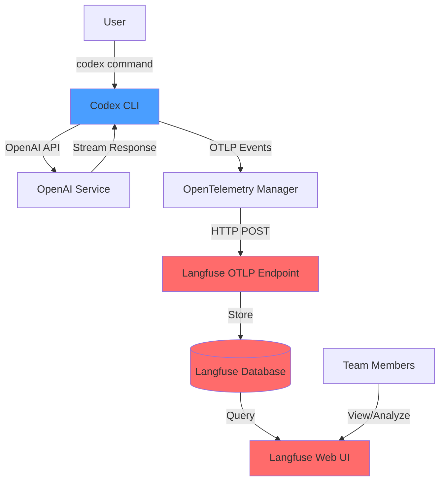
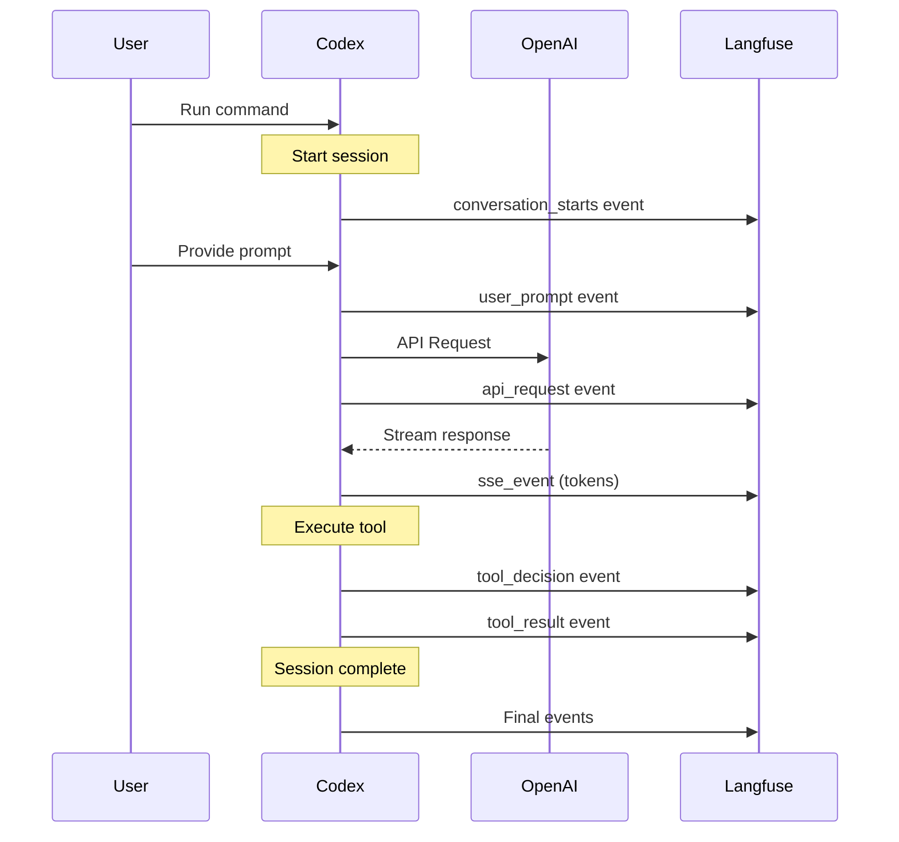
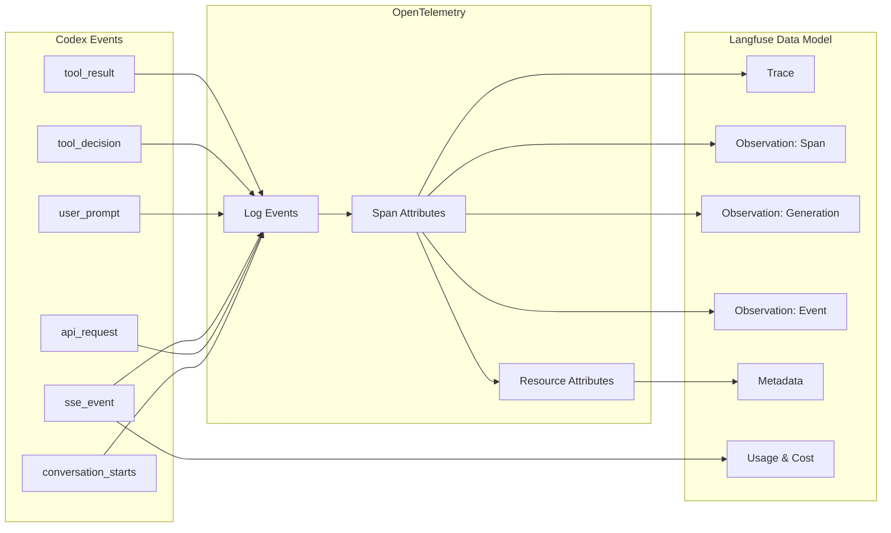
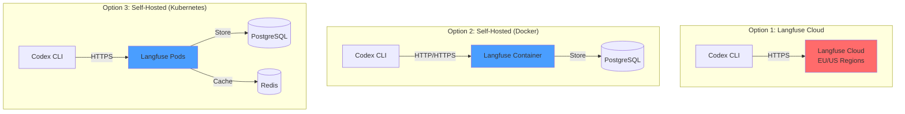

# Langfuse Integration Architecture

This document provides visual representations of how Codex integrates with Langfuse.

## High-Level Architecture



## Data Flow



## Component Architecture

```
┌─────────────────────────────────────────────────────────────┐
│                         Codex CLI                           │
│  ┌───────────────────────────────────────────────────────┐  │
│  │                   Core Application                     │  │
│  │  • User interaction                                    │  │
│  │  • OpenAI API calls                                    │  │
│  │  • Tool execution                                      │  │
│  └──────────────────┬────────────────────────────────────┘  │
│                     │                                        │
│  ┌──────────────────▼─────────────────────────────────────┐ │
│  │              OpenTelemetry Layer                       │ │
│  │  ┌──────────────────────────────────────────────────┐ │ │
│  │  │ OtelManager (codex-rs/otel)                      │ │ │
│  │  │  • Event collection                               │ │ │
│  │  │  • Event enrichment (metadata)                    │ │ │
│  │  │  • Event batching                                 │ │ │
│  │  └──────────────────┬───────────────────────────────┘ │ │
│  │                     │                                  │ │
│  │  ┌──────────────────▼───────────────────────────────┐ │ │
│  │  │ OTLP Exporter (HTTP)                             │ │ │
│  │  │  • Protocol: HTTP/protobuf or HTTP/JSON          │ │ │
│  │  │  • Authentication: Basic Auth                     │ │ │
│  │  │  • Batching & retry logic                        │ │ │
│  │  └──────────────────┬───────────────────────────────┘ │ │
│  └────────────────────┼─────────────────────────────────┘ │
└────────────────────────┼───────────────────────────────────┘
                         │
                         │ HTTPS POST
                         │ /api/public/otel
                         │
┌────────────────────────▼───────────────────────────────────┐
│                  Langfuse Platform                         │
│  ┌─────────────────────────────────────────────────────┐   │
│  │              OTLP Ingestion API                     │   │
│  │  • Endpoint: /api/public/otel                       │   │
│  │  • Authentication: HTTP Basic Auth                  │   │
│  │  • Protocol: HTTP/protobuf, HTTP/JSON               │   │
│  └──────────────────┬──────────────────────────────────┘   │
│                     │                                       │
│  ┌──────────────────▼──────────────────────────────────┐   │
│  │         OpenTelemetry to Langfuse Mapper           │   │
│  │  • Map OTLP spans → Langfuse traces                │   │
│  │  • Extract GenAI attributes                         │   │
│  │  • Calculate costs from token usage                 │   │
│  │  • Parse metadata                                   │   │
│  └──────────────────┬──────────────────────────────────┘   │
│                     │                                       │
│  ┌──────────────────▼──────────────────────────────────┐   │
│  │              Langfuse Database                      │   │
│  │  • Traces & observations                            │   │
│  │  • Prompts & versions                               │   │
│  │  • Evaluations & scores                             │   │
│  │  • Datasets & experiments                           │   │
│  └──────────────────┬──────────────────────────────────┘   │
│                     │                                       │
│  ┌──────────────────▼──────────────────────────────────┐   │
│  │              Langfuse Web UI                        │   │
│  │  • Trace visualization                              │   │
│  │  • Cost analytics                                   │   │
│  │  • Prompt management                                │   │
│  │  • Evaluation tools                                 │   │
│  └─────────────────────────────────────────────────────┘   │
└────────────────────────────────────────────────────────────┘
```

## Event Types and Mappings



## Configuration Flow

```
┌──────────────────────────────────────────────────────────┐
│                User Configuration                        │
│           ~/.codex/config.toml                          │
│                                                          │
│  [otel]                                                  │
│  environment = "production"                              │
│  exporter = "otlp-http"                                  │
│                                                          │
│  [otel.exporter."otlp-http"]                            │
│  endpoint = "https://cloud.langfuse.com/..."            │
│  protocol = "binary"                                     │
│                                                          │
│  [otel.exporter."otlp-http".headers]                    │
│  "Authorization" = "Basic <base64>"                      │
└──────────────────┬───────────────────────────────────────┘
                   │
                   │ Load & Parse
                   ▼
┌──────────────────────────────────────────────────────────┐
│              Config Loader (core/src/config)             │
│  • Parse TOML                                            │
│  • Apply defaults                                        │
│  • Validate settings                                     │
│  • Expand environment variables                          │
└──────────────────┬───────────────────────────────────────┘
                   │
                   │ OtelConfig
                   ▼
┌──────────────────────────────────────────────────────────┐
│          OTEL Provider Builder (core/src/otel_init.rs)   │
│  • Convert config types                                  │
│  • Create OTLP exporter                                  │
│  • Setup resource attributes                             │
│  • Initialize tracer provider                            │
└──────────────────┬───────────────────────────────────────┘
                   │
                   │ OtelProvider
                   ▼
┌──────────────────────────────────────────────────────────┐
│         OTLP HTTP Exporter (otel/src/otel_provider.rs)   │
│  • HTTP client with authentication                       │
│  • Protocol serialization (protobuf/json)                │
│  • Batch processing                                      │
│  • Retry logic                                           │
│  • TLS configuration                                     │
└──────────────────┬───────────────────────────────────────┘
                   │
                   │ Export events
                   ▼
              [Langfuse API]
```

## Metadata Flow

```
User Action → Codex Event
                ↓
        Common Metadata Added:
        • conversation.id
        • app.version
        • auth_mode
        • user.account_id
        • user.email
        • terminal.type
        • model
        • slug
                ↓
        Event-Specific Data:
        • api_request: status_code, duration_ms
        • sse_event: token counts
        • tool_result: success, output
                ↓
        OpenTelemetry Attributes:
        • service.name
        • service.version
        • deployment.environment
                ↓
        Langfuse Processing:
        • Extract trace-level attributes
        • Map to observation types
        • Calculate costs
        • Build hierarchy
                ↓
        Langfuse UI Display:
        • Trace timeline
        • Token usage graphs
        • Cost breakdown
        • Filterable metadata
```

## Deployment Options



## Security Flow

```
┌─────────────────────────────────────────────────┐
│         Credential Management                   │
│                                                 │
│  Option 1: Direct in config.toml               │
│    "Authorization" = "Basic <base64>"           │
│                                                 │
│  Option 2: Environment Variable                 │
│    "Authorization" = "${LANGFUSE_AUTH}"         │
│    export LANGFUSE_AUTH="Basic <base64>"        │
│                                                 │
│  Option 3: Secrets Manager (future)             │
│    Integration with vault/keychain             │
└───────────────────┬─────────────────────────────┘
                    │
                    ▼
┌─────────────────────────────────────────────────┐
│         TLS/SSL Configuration                   │
│                                                 │
│  • CA Certificate (custom trust)                │
│  • Client Certificate (mTLS)                    │
│  • Client Private Key                           │
│                                                 │
│  Paths: Relative to ~/.codex/ or absolute      │
└───────────────────┬─────────────────────────────┘
                    │
                    ▼
┌─────────────────────────────────────────────────┐
│         HTTPS Request                           │
│                                                 │
│  POST /api/public/otel                          │
│  Authorization: Basic <base64>                  │
│  Content-Type: application/x-protobuf           │
│                                                 │
│  [Encrypted OTLP payload]                       │
└───────────────────┬─────────────────────────────┘
                    │
                    ▼
              [Langfuse API]
              • Verify credentials
              • Decrypt payload
              • Process events
```

## Key Advantages

1. **No Code Changes**: Pure configuration
2. **Standard Protocol**: OpenTelemetry (OTLP)
3. **Flexible Deployment**: Cloud or self-hosted
4. **Rich Metadata**: Automatic context propagation
5. **LLM-Specific**: Purpose-built for AI apps
6. **Privacy Control**: Configurable logging levels
7. **Secure**: HTTPS + Authentication + optional mTLS

## References

- [OpenTelemetry Specification](https://opentelemetry.io/docs/specs/)
- [OTLP Protocol](https://opentelemetry.io/docs/specs/otlp/)
- [Langfuse OTLP Endpoint](https://langfuse.com/docs/integrations/opentelemetry)
- [GenAI Semantic Conventions](https://opentelemetry.io/docs/specs/semconv/gen-ai/)
