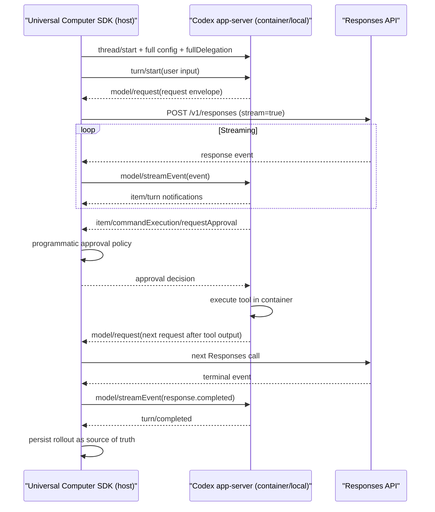
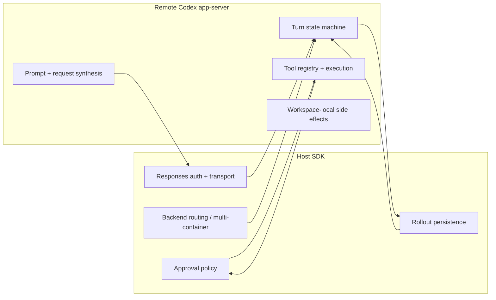

# RFC: Host-Delegated Codex App-Server for Universal Computer

## Summary

Universal Computer already has the right high-level instinct: the host SDK should own orchestration, credentials, approvals, persistence, and backend selection, while the remote runtime should own local execution against the target filesystem and sandbox.

Today, those responsibilities are split awkwardly. Universal Computer's Python SDK builds the Responses request, defines tools in Python, and interprets raw model output into actionable tool calls. Codex app-server, by contrast, already has a richer Rust-native execution engine, tool surface, approval model, and event model, but it assumes Codex itself is the party speaking to the Responses API and, in normal operation, the party managing rollout persistence.

The proposal is to add a new **full delegation mode** to codex app-server:

- Codex still runs inside the destination container or locally.
- Codex still owns prompt assembly, tool registration, tool execution, approvals, and turn semantics.
- The **host SDK** becomes the sole party that talks to the Responses API.
- The **host SDK** also becomes the source of truth for rollout persistence.
- The app-server protocol grows a small set of new server-initiated requests and client responses so Codex can ask the host to create, stream, cancel, and finalize upstream model requests.

This gives Universal Computer what it wants: reuse of Codex's Rust-native tool/runtime behavior without giving up host-side orchestration, multi-container routing, approval policy, or host-managed conversation state.

## Context

### What Universal Computer does well today

From the Universal Computer side, the architecture is already clean:

- `Agent` owns declarative configuration:
  - `base_instructions`
  - `developer_instructions`
  - `user_instructions`
  - `plugins`
  - `tools`
  - `sampling_params`
- `TaskContext` owns startup, manifest injection, snapshotting, and session binding.
- `Task` is the durable rollout object:
  - it stores context
  - it stores resumable session state
  - it streams raw Responses events
  - it pauses when tool calls are pending
- plugins are more than tool bundles:
  - they can contribute instructions
  - mutate context
  - mutate sampling params
  - mutate manifest/session setup

That is an important constraint: Universal Computer is not merely a remote shell. It is a **host orchestration framework**.

### What Codex app-server already provides

Codex app-server is already surprisingly close to what we need:

- thread and turn lifecycle APIs
- streaming turn/item notifications
- server-initiated approval requests
- dynamic tools
- apps/plugins/skills integration
- configurable developer instructions and other session settings
- client-managed notification transport

But the current model assumes:

- Codex itself makes the Responses API request
- Codex owns the upstream stream lifecycle
- Codex is the natural home for thread persistence

That assumption is the seam that needs to change.

## Design principle

The right boundary is:

- **Host SDK owns external orchestration**
- **Remote Codex owns local execution semantics**

More concretely:

### Host-owned

- Responses API transport and credentials
- rollout persistence
- backend selection
- multi-container routing
- approval UX and policy
- high-level session bootstrap

### Codex-owned

- instruction compilation
- model request planning
- tool schema materialization
- tool execution against the live workspace/container
- item/turn state machine
- normalization of model events into Codex semantics

This is the key pushback: the host should not have to reconstruct Codex's prompts, tool schemas, or internal turn loop. If we force the SDK to do that, we reintroduce the exact duplication you want to eliminate.

## Goals

1. Support running Codex app-server in a target container or locally.
2. Allow the host SDK to be the only component that talks to the Responses API.
3. Preserve Codex as the implementation of the default tool surface.
4. Preserve host-side approvals for all tools.
5. Preserve host-side rollout persistence as the source of truth.
6. Allow full client-provided configuration:
   - base instructions
   - developer instructions
   - user instructions
   - tool/plugin/app config
7. Allow the host to override or replace the default tool set.
8. Keep the protocol high-level and transport-agnostic enough for non-Docker backends.

## Non-goals

1. Re-implement Codex tool behavior in the Python SDK.
2. Make the host responsible for prompt assembly.
3. Force app-server to lose its current direct-to-Responses mode.
4. Solve every multi-agent routing problem in the first iteration.

## Proposed model: Full Delegation Mode

Add a new app-server execution mode, conceptually:

- `direct` mode: current behavior
- `fullDelegation` mode: new behavior

In `fullDelegation` mode:

1. The host starts app-server inside the target environment.
2. The host provides all desired configuration at thread/session startup.
3. Codex prepares the next upstream Responses request, but does not send it.
4. Codex emits a server-initiated request to the host containing the prepared upstream request envelope.
5. The host executes that request against the Responses API.
6. The host streams upstream events back into app-server.
7. Codex consumes those events, updates turn state, emits its normal item/turn notifications, and requests approvals or user input as needed.
8. The host persists the resulting rollout externally.

This is not "remote shell plus JSON." It is better understood as **remote Codex with externalized model transport**.

## Why this fits Universal Computer

Today Universal Computer's `Task.run()` does three important jobs:

1. build the request
2. stream events
3. pause for tool calls

Under this RFC:

- job 1 moves from Python to Codex
- job 2 remains host-owned at the transport layer
- job 3 becomes cleaner, because Codex itself now owns tool interpretation and execution

That is a net simplification.

## Protocol additions

The existing app-server pattern to imitate is the approval flow: Codex can already issue server-initiated JSON-RPC requests to the client and resume when the client responds.

Full delegation should reuse that same pattern.

## New concepts

### 1. Delegated model request

Codex needs a way to say:

> "Here is the exact upstream request I want to make. Please make it for me, and stream the result back."

Proposed request:

- `model/request`

Purpose:

- server-initiated request from Codex to host
- carries a canonicalized Responses request envelope

This envelope should include, at minimum:

- model
- instructions or compiled system input
- input items/messages
- tool definitions
- reasoning config
- tool-choice config
- request-level overrides derived from SDK/user configuration, such as reasoning effort, summary mode, verbosity, and other per-turn sampling controls
- metadata needed for correlation
- optional previous-response linkage if Codex wants it
- stream expectation
- opaque session/turn correlation ids

The important point is that this is **Codex-authored**. The host forwards it, it does not reinterpret it.

### 2. Delegated model stream injection

The host needs a way to stream upstream events back into Codex.

Proposed client method:

- `model/streamEvent`

Purpose:

- client-to-server notification or request delivering one upstream Responses stream event at a time

The server should accept:

- raw upstream event payload
- correlation id tying the event to the outstanding `model/request`

This lets Codex continue using its native event handling logic.

### 3. Terminal stream semantics

For normal operation, Codex should infer terminal model state from the raw upstream Responses events themselves, especially `response.completed` and `response.failed`. In other words, the canonical end-of-turn signal should come from the same event stream Codex is already consuming.

A separate client method is only needed for cases where the host cannot provide a terminal Responses event, for example:

- the host canceled the upstream request before a terminal event was emitted
- the network stream disconnected mid-flight
- the host rejected the delegated request before sending it upstream

In that narrower case, a small escape hatch such as `model/streamAborted` is useful. It should carry:

- delegated request id
- abort reason such as `canceled`, `disconnected`, or `requestRejected`
- normalized error info if relevant

This keeps the happy path simple while still giving Codex a way to distinguish "the model finished" from "the host-side transport broke."

### 4. Delegated model cancellation

Codex may need to ask the host to cancel an in-flight upstream request.

Proposed server request:

- `model/cancel`

This is important for:

- turn interruption
- approval denial during streaming
- client disconnect handling
- compaction or reroute logic

### 5. External rollout mode

Codex needs to know it is not the durable source of truth.

Proposed thread/session config:

- `rolloutOwnership: "server" | "client"`

In the new mode, use `"client"`.

Behaviorally, this means:

- server may still keep ephemeral in-memory turn state
- server should not assume persisted thread state is canonical
- resume/fork semantics should allow the client to provide prior rollout context explicitly

### 6. External history hydrate

If the host owns persistence, Codex needs a way to rehydrate a thread from client-supplied history.

Proposed startup field or dedicated method:

- `thread/start` or `thread/resume` with `initialItems` / `turnHistory`

This should be the normalized Codex-facing history representation, not raw Responses-only items.

That keeps Codex's turn engine informed without forcing SQLite/file rollout ownership back into the container.

There is already an implicit translation boundary here today: Codex does not operate on raw SSE events as its durable thread model. It turns upstream Responses output into a richer internal history made of turns and items. Client-owned rollout mode would make that boundary explicit. The host would persist the Codex-facing item history it receives over app-server notifications, then feed that normalized history back on resume, rather than trying to reconstruct a thread from raw Responses API events alone.

## Proposed event surface

A clean high-level set could be:

### Server -> client

- `model/request`
- `model/cancel`
- `delegation/request` for subagents or cross-container execution
- existing approval requests remain unchanged
- existing `item/tool/requestUserInput` remains unchanged

### Client -> server

- `model/streamEvent`
- `model/streamAborted`
- `model/requestRejected`
- `delegation/result`
- existing approval decisions remain unchanged
- existing tool/user-input responses remain unchanged

## Mermaid: end-to-end flow

## Mermaid: state ownership

In plain English: the host SDK remains the control plane, and Codex inside the container remains the execution plane. The host is responsible for the things that need global visibility or trust: talking to the Responses API, persisting rollout state, deciding approval policy, and deciding where delegated work should run. Codex is responsible for the things that need local workspace context: assembling the actual model request, running the turn state machine, choosing and executing tools, and applying side effects inside the container. The diagram below is just showing that split of responsibilities rather than a strict request-by-request sequence.

## Behavioral changes required inside Codex

### 1. Separate "prepare request" from "send request"

Today those are effectively fused. Full delegation requires Codex to:

- build the canonical upstream request
- stop before transport
- wait for externally streamed events

That is the fundamental internal refactor.

### 2. Accept externally sourced Responses events as first-class input

Codex must be able to ingest a Responses event stream that it did not open itself.

This means:

- correlation of event stream to active turn/request
- same parsing, validation, and item synthesis path as direct mode
- same terminal handling and retry semantics where applicable

### 3. Make thread persistence optional, not authoritative

In client-owned rollout mode, Codex should treat persistence as operational cache, not source of truth.

A good discipline is:

- in-memory state for active turn execution
- explicit rehydrate from client history on resume
- no hidden reliance on local rollout files for correctness

### 4. Make tool registry fully session-configurable

This is already partly present through dynamic tools, plugins, and apps, but the new mode should make it explicit that the tool surface may be:

- default Codex tools
- default Codex tools plus client additions
- a full client override
- a minimal safe subset

The important policy question is precedence. My recommendation:

- `default`
- `default + additive overrides`
- `replace entirely`

as three explicit modes, not implicit merging.

### 5. Preserve current approval semantics across all tools

Approvals must remain server-initiated from Codex to host, because that is the clean point where the host can inject policy without reimplementing runtime behavior.

Operationally, this likely means Codex should be started with an approval configuration that never blocks on an in-container human prompt and instead always routes approval decisions through app-server requests to the host. The host SDK then becomes the policy engine and UI surface for tool approvals, while Codex remains the party that formulates the execution request and enforces the answer.

The host should not be approving raw Responses tool call output. It should be approving Codex's normalized execution intent: "run this command," "apply this patch," "grant this network access," and so on.

### 6. Support host-intercepted delegation as a future sibling of model delegation

If you want multi-container delegation, do not hide subagent creation entirely inside the container runtime. Give it a parallel host-visible control point.

Concretely, app-server should emit a `delegation/request` event whenever Codex wants to spawn a subagent. That event should include:

- the parent thread/turn context
- the requested subagent instructions and input items
- the requested tool/profile configuration
- execution hints such as preferred cwd, sandbox, or model
- enough metadata for the host to correlate the child back to the parent

The host SDK can then choose one of two paths:

1. run the subagent in the same container and return a `delegation/result`
2. materialize it as a separate top-level agent on another backend or container and still return a `delegation/result`

In both cases, Codex should treat the result as a structured child outcome rather than assuming where or how the subagent ran. That gives the SDK user real control over topology without making Codex blind to delegated work.

## Configuration model

Full delegation mode must support all the configuration Universal Computer already treats as first-class:

- base instructions
- developer instructions
- user instructions
- model choice
- sampling params
- plugin declarations
- app/plugin auth context
- tool override policy
- approval policy
- cwd / manifest / workspace metadata

The cleanest way to do this is:

1. client sends declarative config to app-server
2. Codex composes the actual upstream request
3. host transmits that request unchanged

This preserves client control without creating dual prompt builders.

In practice, this means there are two useful layers of configuration:

- session-level defaults supplied when establishing the thread or runtime
- request-level overrides supplied per turn, such as reasoning effort, summaries, verbosity, or other sampling controls

Codex should own how those layers merge into the final upstream request, but the SDK user should still be able to express both layers declaratively.

## Tooling model

Universal Computer's current plugins can affect:

- tools
- instructions
- sampling params
- context
- manifest

Codex app-server should not try to mimic Python plugin objects. Instead, the protocol should expose the resulting configuration effects in transportable form.

Three buckets matter:

### 1. Native Codex tools

Examples:

- shell
- apply patch
- filesystem-like behavior
- skills/apps tooling

These should stay implemented in Rust.

### 2. Declarative client-added tools

These are already conceptually close to dynamic tools.

### 3. Host policy wrappers

The host may still want to:

- require approval
- deny certain tools
- redirect certain actions
- attach metadata

This should be policy/config, not alternative execution logic.

## Rollout ownership

This deserves explicit treatment.

If the host is the source of truth, then app-server should not quietly persist a more authoritative local reality than the host sees.

Recommended behavior in client-owned rollout mode:

- active turn state exists in memory inside Codex
- the host receives all canonical turn/item notifications
- the host persists them
- resume requires the host to resupply prior normalized history
- local persistence, if any, is cache-only and discardable

That keeps recovery honest.

## Failure semantics

Full delegation mode needs explicit failure boundaries.

### Host-side failures

Examples:

- Responses auth failure
- network failure
- stream disconnect
- host policy rejection

These should arrive back in Codex as delegated request failures and surface through normal turn failure notifications.

### Codex-side failures

Examples:

- malformed upstream event
- incompatible tool result
- internal turn-state fault

These should surface as Codex errors to the host.

### Split-brain prevention

At most one outstanding delegated model request should be active per active turn segment unless Codex explicitly supports multiplexing. Start single-flight.

That constraint is worth being conservative about.

It is different from "only one tool runs at a time" or "only one turn exists at a time." The point is narrower: for a given live turn segment, there should be one authoritative upstream model stream that Codex is currently interpreting. If the host allowed two overlapping delegated Responses streams to feed the same turn state, Codex would need a much more complicated merge model for deltas, tool calls, and terminal events. Starting with single-flight keeps turn state deterministic.

## Security and trust boundaries

This design is stronger than today's Python-tool model in one important way: the canonical executor of shell and file actions moves into the same Rust runtime that already knows Codex's approval and event semantics.

That said, the host now becomes highly privileged because it owns:

- auth
- transcript persistence
- upstream transport
- approval decisions

That is acceptable, because Universal Computer already lives at that privilege level.

## Migration path

### Phase 1

- add `fullDelegation` execution mode
- add `model/request`
- add `model/streamEvent`
- add `model/streamAborted`
- add `model/cancel`
- add client-owned rollout mode with startup rehydrate

This is enough for a single-container Universal Computer integration.

### Phase 2

- add explicit tool-set override modes
- harden resume/fork semantics for externally persisted history
- support more complete correlation and retry rules

### Phase 3

- add host-visible delegation/subagent interception
- route subagents to alternate containers/backends

## Open questions

1. What is the canonical wire format for delegated model requests? My recommendation: a Codex-defined envelope that is close to Responses payloads, but explicitly versioned and correlation-safe.
2. Should the host stream raw Responses events or normalized Codex events back? Raw Responses events. Normalization should remain inside Codex.
3. Should local persistence be disabled entirely in client-owned rollout mode? Prefer "non-authoritative cache" over "disabled," but correctness must not depend on it.
4. Should tool overrides be merged or replaced? There is a real difference:
   - merged means "start with Codex defaults, then add or selectively override entries"
   - replaced means "the client supplies the entire tool surface and Codex defaults are not implicitly present"
   Support both, explicitly. Implicit merge will become a policy trap.
5. How much of plugin behavior should be representable over protocol? Only the effects, not the Python object model.

## Changes required in Universal Computer

The Codex-side protocol changes are only half of the story. To make this architecture real, Universal Computer also needs to grow a host-side integration layer that treats Codex app-server as a remote execution runtime rather than treating the Responses API as the only runtime boundary.

At a high level, Universal Computer should stop being responsible for implementing the default Codex tool surface in Python and instead become responsible for:

- provisioning a compatible Codex binary
- starting and supervising app-server
- relaying delegated model traffic to the selected provider
- persisting rollout state as the canonical host-side record
- exposing SDK ergonomics for tool configuration, approvals, and delegation routing

### 1. Pin and provision a Codex version

Universal Computer will need an explicit notion of the Codex runtime version it expects to launch.

That likely means:

- adding a pinned Codex version field to the agent or runtime configuration
- defining how that resolves to a concrete binary artifact for the current host platform
- making the app-server protocol version part of compatibility checks

This should be treated as a first-class runtime dependency, not an incidental local executable lookup. If the host and container disagree about protocol shape, delegation mode will fail in confusing ways, so version pinning should be deliberate.

Recommended direction:

- Universal Computer pins a Codex release or build identifier explicitly
- the host resolves and caches that artifact
- the runtime startup path verifies the binary version before starting app-server

### 2. Reuse existing backends to place the Codex binary in the destination environment

Universal Computer already knows how to create and resume execution environments. It should reuse that backend abstraction for Codex provisioning rather than inventing a separate deployment system.

Concretely, the current backend model is already a good fit for binary staging:

- `BaseSandboxClient` creates and resumes sessions
- `BaseSandboxSession` exposes `write`, `read`, `exec`, and workspace materialization
- manifest entries such as `LocalFile` already support copying a host file into the workspace and applying permissions via `chmod`

So the binary-placement story does not need a brand-new distribution mechanism. Universal Computer can either:

- stage the pinned Codex binary as a manifest artifact with executable permissions, or
- push it into the workspace during session startup with `session.write(...)` followed by `chmod`

The first option is especially attractive because it fits the existing manifest/snapshot model and keeps provisioning declarative.

At a high level, each backend would need to support:

- ensuring the Codex binary is present in the target environment
- placing any required companion assets if Codex needs them
- starting `codex app-server` with the right arguments
- returning a live transport handle back to the host SDK

For local execution, this step can degenerate into "use a local binary and skip copy." For remote or containerized execution, this becomes an explicit staging step.

The important design point is that backend-specific logic stays confined to:

- binary placement
- process startup
- transport attachment
- snapshot and manifest lifecycle

and not tool execution.

One nuance from the codebase: backend reuse is straightforward for file placement, but not yet for long-lived supervised process attachment. Universal Computer's shared session API supports one-shot `exec` everywhere, while PTY-style attached process interaction exists only on some backends. If Codex app-server is going to be launched as a long-running child process, Universal Computer will likely need one additional backend-neutral capability for "start a process and keep a live byte stream attached," rather than trying to shoehorn everything through one-shot exec.

### 3. Replace Python implementations of the default tool surface with symbolic tool references

Universal Computer can likely delete or de-emphasize the Python implementations of the default filesystem and shell tool behavior once Codex is the executor.

The code today makes this fairly concrete: the built-in tool surface is assembled from Python plugins like `Filesystem`, `Shell`, `ApplyPatch`, and `Compaction`. The first three are thin wrappers that bind to a `SandboxSession`, expose tool schemas, and add instruction fragments; they are not deep subsystems in their own right.

But the SDK still needs a way to express tool policy and shape the tool surface. So instead of Python tool implementations being the source of truth, they should become declarative references, for example:

- enable Codex shell
- disable Codex apply-patch
- use the default Codex tool set
- replace the default tool set with a minimal subset

In other words, the Python layer should continue to speak in terms of tool identities and policy, but not carry the execution logic for the built-in tools.

This is important for UX. SDK users still want to write things like:

- "enable shell but not apply patch"
- "disable filesystem writes"
- "use only custom tools"

Those should remain easy, but they should compile down to app-server configuration rather than selecting Python classes that implement the behavior directly.

The one built-in plugin that does not fit the "just replace it with a Codex tool" bucket is compaction. In Universal Computer today, compaction is expressed as sampling-parameter and context-processing behavior rather than as a shell/filesystem tool. So the migration should separate:

- built-in execution tools that move to Codex
- host-side request shaping policies, like compaction thresholds, that may still belong in the SDK and need to be forwarded into delegated model requests

### 4. Add a dedicated app-server package or module

Universal Computer should grow a dedicated host-side app-server integration package rather than smearing the logic across the existing agent runtime.

Conceptually, that package would own:

- app-server process lifecycle
- connection management
- protocol type definitions
- delegated model request handling
- approval request handling
- delegated subagent handling
- rollout event capture and persistence hooks

A clean package boundary here matters because this integration is not just "another tool." It is a new runtime substrate.

A useful mental split would be:

- core Universal Computer agent model
- backend/session abstractions
- provider adapters
- app-server bridge

That keeps the Codex-specific transport logic from leaking into unrelated parts of the SDK.

### 5. Support the new delegated app-server events

Universal Computer will need host-side handlers for the new protocol surface proposed above.

At minimum, that means understanding and responding to:

- `model/request`
- `model/streamEvent`
- `model/streamAborted`
- `model/cancel`
- `delegation/request`
- `delegation/result`
- existing approval requests

In practice, the host runtime loop changes from:

- call `responses.create(...)`
- stream raw events
- inspect pending tool calls

to:

- wait for `model/request` from Codex
- execute that request against the selected provider
- feed raw upstream events back with `model/streamEvent`
- honor `model/cancel` and approval flows
- optionally route `delegation/request` to a different container or backend

That is a meaningful runtime refactor, but it is conceptually clean: Universal Computer becomes an orchestrator around Codex rather than a reimplementation of Codex behavior.

### 6. Add a host-side multi-provider abstraction

Today Universal Computer is structurally very OpenAI-shaped because the runtime path is built around the Responses API client. In delegated mode, that logic becomes even more central, so it should be abstracted intentionally.

The current code is explicit about this: `Task` stores an `openai.AsyncClient` and its default producer literally calls `client.responses.create(...)`. So multi-provider support is not a small configuration tweak; it is a real runtime abstraction change.

The host needs a provider abstraction capable of:

- taking a Codex-authored delegated model request
- translating it to the selected upstream provider call shape
- streaming provider events back into the common app-server event format
- surfacing provider-specific failures in a normalized way

For OpenAI-backed flows, that can stay close to raw Responses semantics.

For Anthropic or other providers, the host may need an adapter layer that maps:

- request fields
- tool-calling events
- reasoning/summary controls where supported
- terminal and error events

back into the event shape Codex expects.

This is precisely why the translation boundary should live on the host, not in the container. Provider choice is a host concern.

Recommended direction:

- define a `ModelProvider` or similarly named host-side interface
- keep OpenAI as the reference implementation
- add provider capability metadata so unsupported delegated-request features can fail clearly rather than degrade silently

There is already a hint of the right design elsewhere in Universal Computer: the memory subsystem defines normalized result schemas specifically so the rest of the system does not need to understand provider-specific formats. The delegated app-server bridge should follow the same principle for streamed model events.

### 7. Add host-side rollout persistence built around Codex item history

If the host is now the source of truth, Universal Computer should persist the Codex-facing event history it receives from app-server, not just the raw upstream Responses interaction.

That likely means persisting:

- thread identity
- turns
- normalized items
- approval decisions
- delegation edges between parent and child agents
- provider and runtime metadata

This persistence layer should support:

- resume into the same container
- resume into a fresh container with rehydrated history
- cross-backend continuation when the SDK chooses to re-home the work

### 8. Transport recommendation: prefer stdio over a reliable byte stream bridge

For the host-to-container app-server transport, the safest recommendation is:

- first choice: stdio over an attached process handle
- second choice: a reliable byte-stream tunnel such as SSH or a backend-managed TCP stream

Why:

- app-server traffic is ordered, stateful, and request-response oriented
- JSON-RPC + streaming notifications want reliable delivery and backpressure

`stdio` is still the right target transport because Codex app-server already supports it as the primary mode. But after a deeper look at Universal Computer, there is an important implementation detail: the current shared session abstraction does not yet provide a backend-neutral "launch a long-lived child process and keep stdin/stdout attached" API. It provides:

- one-shot `exec` everywhere
- optional PTY process support on some backends such as local Unix and Modal
- no equivalent attached-process primitive on Docker today

So the recommendation should be more precise:

- standardize on app-server `stdio` as the protocol transport
- add a new backend-neutral attached-process capability to Universal Computer for long-lived bridge processes
- make that capability part of the expected contract for all supported backends, instead of treating it as an optimization for only a few environments
- implement that capability per backend, instead of introducing a separate network protocol just to compensate for the missing primitive

If Universal Computer can directly attach to the launched process, `stdio` is ideal because:

- it matches app-server's primary supported transport
- it avoids inventing network semantics
- it inherits process lifecycle naturally
- it is easy to secure because nothing is exposed on a network port

For Docker specifically, that likely means adding a backend implementation that can launch Codex as an attached process rather than relying only on detached one-shot execs. For example, the backend could use an attached `docker exec` session or make Codex the supervised long-lived process inside the container and bridge its stdio back to the host.

If a direct process attachment is impossible because of the backend, the next best choice is a reliable stream transport tunneled over something the backend already trusts:

- SSH port forwarding or command execution with pipes
- a backend-provided TCP tunnel

I would not recommend treating app-server websocket as the default fallback here, because Codex app-server currently describes websocket transport as experimental and unsupported. If a backend absolutely forces a bridged network transport, prefer a reliable stream that still carries stdio-like semantics over inventing a new public network surface.

Recommendation:

- standardize on `stdio` as the canonical transport
- add a UC session-level attached-process abstraction to make `stdio` practical across backends
- require all supported backends to implement an attached-process bridge capable of launching and supervising app-server with a live byte stream
- use SSH or another reliable stream tunnel only when direct attachment is impossible
- treat websocket support as an implementation detail of last resort, not the preferred contract

This keeps the transport boring, which is exactly what you want for the control plane of a remote agent runtime.

### 9. Suggested Universal Computer rollout plan

A pragmatic order of operations would be:

1. add a Codex runtime abstraction with version pinning and binary provisioning
2. add an app-server bridge package with stdio-based transport
3. implement OpenAI delegated model handling end to end
4. persist Codex-facing history host-side and support resume
5. replace Python built-in tool execution with declarative tool enablement
6. add subagent interception and routing
7. add additional provider adapters such as Anthropic

That sequence gets a single-container OpenAI-backed flow working early while leaving room for multi-provider and multi-container sophistication later.

## Recommendation

Build **full delegation mode** as an app-server-level capability, not as a Universal Computer-specific shim.

The winning shape is:

- remote Codex prepares
- host transmits
- remote Codex interprets
- host persists

That preserves the best properties of both systems:

- Universal Computer keeps its orchestration superpower
- Codex becomes the reusable execution engine and tool runtime you actually want to standardize on
